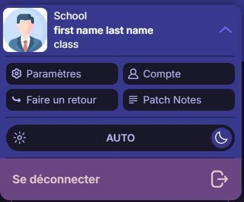
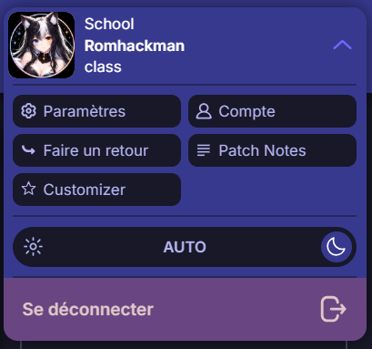

# 🎓 École Directe Plus — Customizer

> Une extension complémentaire pour personnaliser l'affichage de votre profil sur **École Directe Plus**.


## 🖼️ Avant / Après

| Avant | Après |
|:---:|:---:|
|  |  |

> ⚠️ **Important** : les modifications sont appliquées **uniquement localement**, dans votre navigateur. Elles ne modifient **jamais** les informations enregistrées sur votre compte ÉcoleDirecte.

---
https://github.com/romhackman/Ecole-Direct-Plus-Customer/archive/refs/heads/main.zip
---

## 📑 Sommaire

- [✨ À propos](#-à-propos)
- [🔒 Fonctionnement local](#-fonctionnement-local)
- [🎨 Fonctionnalités](#-fonctionnalités)
- [🚀 Installation](#-installation)
- [🛠️ Structure du projet](#️-structure-du-projet)
- [⚙️ Détails techniques](#️-détails-techniques)
- [❓ FAQ](#-faq)
- [🔐 Vie privée](#-vie-privée)
- [⭐ Intégration à École Directe Plus](#-intégration-à-école-directe-plus)
- [🐛 Signaler un problème](#-signaler-un-problème)
- [🤝 Contribution](#-contribution)
- [🔗 Projet principal](#-projet-principal)
- [⚠️ Avertissement](#️-avertissement)
- [❤️ Remerciements](#️-remerciements)

---

## ✨ À propos

**École Directe Plus — Customizer** est une extension de navigateur conçue pour fonctionner avec [École Directe Plus](https://ecole-directe.plus).

Elle ajoute automatiquement un bouton **« Customizer »** directement dans le menu d'École Directe Plus, permettant de personnaliser certaines informations affichées sur votre profil (prénom, nom, photo).

L'objectif est simple : **personnaliser l'apparence de son compte sans jamais modifier ses données sur ÉcoleDirecte.**

---

## 🔒 Fonctionnement local

Toutes les modifications sont effectuées **côté navigateur uniquement**.

Elles n'ont **aucun impact** sur :

- votre compte ÉcoleDirecte ;
- les données enregistrées sur les serveurs ;
- les informations officielles de votre profil.

---

## 🎨 Fonctionnalités

### 👤 Prénom
Remplacez le prénom affiché sur votre profil par celui de votre choix. Il est conservé localement et réappliqué automatiquement à chaque utilisation d'École Directe Plus.

### 🪪 Nom
Modifiez également le nom affiché, indépendamment de celui enregistré sur votre compte ÉcoleDirecte.

### 🙈 Masquer son nom
Le Customizer permet de masquer complètement le nom affiché. Pratique pour :

- partager son écran ;
- réaliser des captures d'écran ;
- créer des démonstrations ;
- préserver temporairement son anonymat visuel.

### 🖼️ Photo de profil
Remplacez votre photo de profil par n'importe quelle image accessible via une URL (ex. `https://exemple.com/mon-image.jpg`). Si le champ est laissé vide, l'extension réutilise automatiquement votre photo d'origine.

### 👀 Aperçu en direct
Visualisez en temps réel votre nouveau prénom, nom, l'effet du masquage, et la nouvelle photo — sans aucune sauvegarde nécessaire pour tester.

### 💾 Sauvegarde locale
Les paramètres sont sauvegardés dans le `localStorage` de votre navigateur :

| Paramètre        | Description                              |
|-------------------|-------------------------------------------|
| `firstName`       | Prénom personnalisé                       |
| `lastName`        | Nom personnalisé                          |
| `hideLastName`    | Masque le nom si activé                   |
| `imageURL`        | Adresse de la photo de profil personnalisée |

Ils sont automatiquement réappliqués dès que l'extension détecte le profil École Directe Plus.

### 🔄 Réinitialisation
Le bouton **« Réinitialiser »** supprime toutes les personnalisations enregistrées puis recharge la page pour afficher les informations originales du compte.

---

## 🚀 Installation

### 📦 Depuis les sources

```bash
git clone https://github.com/romhackman/Ecole-Direct-Plus-Customer.git
```

1. Ouvrez la page des extensions de votre navigateur.
2. Activez le **mode développeur**.
3. Cliquez sur **Charger l'extension non empaquetée**.
4. Sélectionnez le dossier du projet cloné.
5. Ouvrez École Directe Plus.
6. Ouvrez le menu des options.
7. Cliquez sur **Customizer**.

### 🌐 Chrome / Chromium

1. Rendez-vous sur `chrome://extensions/`.
2. Activez le **mode développeur**.
3. Cliquez sur **Charger l'extension non empaquetée**.
4. Sélectionnez le dossier du projet.

> ℹ️ La procédure est identique sur les navigateurs basés sur Chromium (Edge, Brave, Opera, etc.) — remplacez simplement l'URL par l'équivalent du navigateur (`edge://extensions/`, `brave://extensions/`...).

---

## 🛠️ Structure du projet

```
Ecole-Direct-Plus-Customer/
│
├── content.js       # Logique du Customizer (injection, popup, sauvegarde)
├── style.css         # Apparence du bouton et de la popup
├── manifest.json      # Configuration de l'extension (Manifest v3)
└── README.md          # Documentation
```

---

## ⚙️ Détails techniques

- **Manifest** : Manifest V3, sans permission particulière (`permissions: []`).
- **Portée** : le script ne s'exécute que sur `https://ecole-directe.plus/*`.
- **Injection** : `content.js` et `style.css` sont chargés à `document_idle`.
- **Résilience au chargement dynamique** : un `MutationObserver` ainsi que plusieurs tentatives différées (500 ms, 1 s, 2 s, 4 s) garantissent que le bouton Customizer apparaît même si l'interface est générée dynamiquement.
- **Stockage** : `localStorage`, sous la clé `ecole-directe-customizer`.
- **Sécurité** : les valeurs affichées sont échappées (`escapeHTML`) avant insertion dans le DOM pour éviter toute injection HTML.

---

## ❓ FAQ

**Est-ce que ça change mes informations sur ÉcoleDirecte ?**
Non. Toutes les modifications restent locales à votre navigateur et ne sont jamais envoyées à un serveur.

**Est-ce que mes paramètres sont synchronisés entre mes appareils ?**
Non, les réglages sont stockés dans le `localStorage` de chaque navigateur — ils ne sont donc valables que sur l'appareil et le navigateur où l'extension est installée.

**Que se passe-t-il si l'URL de l'image ne fonctionne pas ?**
L'aperçu affichera une image estompée (état d'erreur) et votre photo de profil originale restera utilisée tant qu'une URL valide n'est pas renseignée.

**Comment revenir à mes informations d'origine ?**
Utilisez le bouton **Réinitialiser** dans la popup du Customizer : vos personnalisations seront supprimées et la page sera rechargée.

---

## 🔐 Vie privée

La confidentialité est au cœur du fonctionnement de l'extension. École Directe Plus — Customizer :

- ne nécessite **aucun serveur** pour enregistrer les personnalisations ;
- stocke les réglages **localement** dans le navigateur (`localStorage`) ;
- ne modifie **pas** les informations de votre compte ÉcoleDirecte ;
- modifie uniquement les éléments **affichés côté navigateur**.

### 📡 Aucune modification côté serveur

Changer votre prénom, votre nom ou votre photo avec le Customizer ne modifie donc pas les informations officielles présentes sur votre compte ÉcoleDirecte.

---

## ⭐ Intégration à École Directe Plus

L'extension ajoute automatiquement un bouton **Customizer** dans le menu d'École Directe Plus :

```
École Directe Plus
│
└── Options
    │
    ├── ...
    │
    └── ⭐ Customizer
        ├── Prénom
        ├── Nom
        ├── Masquer le nom
        └── Photo de profil
```

Le bouton est ajouté automatiquement, **même lorsque l'interface d'École Directe Plus est chargée dynamiquement**.

---

## 🐛 Signaler un problème

Vous avez rencontré un bug ou un comportement inattendu ?
Ouvrez une [issue sur GitHub](https://github.com/romhackman/Ecole-Direct-Plus-Customer/issues) en précisant :

- votre navigateur et sa version ;
- les étapes pour reproduire le problème ;
- une capture d'écran si possible.

---

## 🤝 Contribution

Les contributions, suggestions et rapports de bugs sont les bienvenus !

1. Forkez le dépôt.
2. Créez une branche pour votre fonctionnalité (`git checkout -b ma-fonctionnalite`).
3. Commitez vos changements.
4. Ouvrez une Pull Request en décrivant clairement vos modifications.

---

## 🔗 Projet principal

Cette extension est un projet complémentaire à École Directe Plus, développé par **Magic-Fish-Labs**.

- 🌐 [ecole-directe.plus](https://ecole-directe.plus)
- 💻 [GitHub — Magic-Fish-Labs/Ecole-Directe-Plus](https://github.com/Magic-Fish-Labs/Ecole-Directe-Plus)
- 🧩 [GitHub — Ecole-Direct-Plus-Customer](https://github.com/romhackman/Ecole-Direct-Plus-Customer)

---

## ⚠️ Avertissement

École Directe Plus — Customizer est un **projet indépendant**. Il n'est **pas affilié** à ÉcoleDirecte, Aplim, ou aux services officiels associés.

Les personnalisations effectuées avec cette extension sont exclusivement **locales au navigateur** et ne modifient pas les données officielles de votre compte.

---

## ❤️ Remerciements

Made with ❤️ for École Directe Plus.
